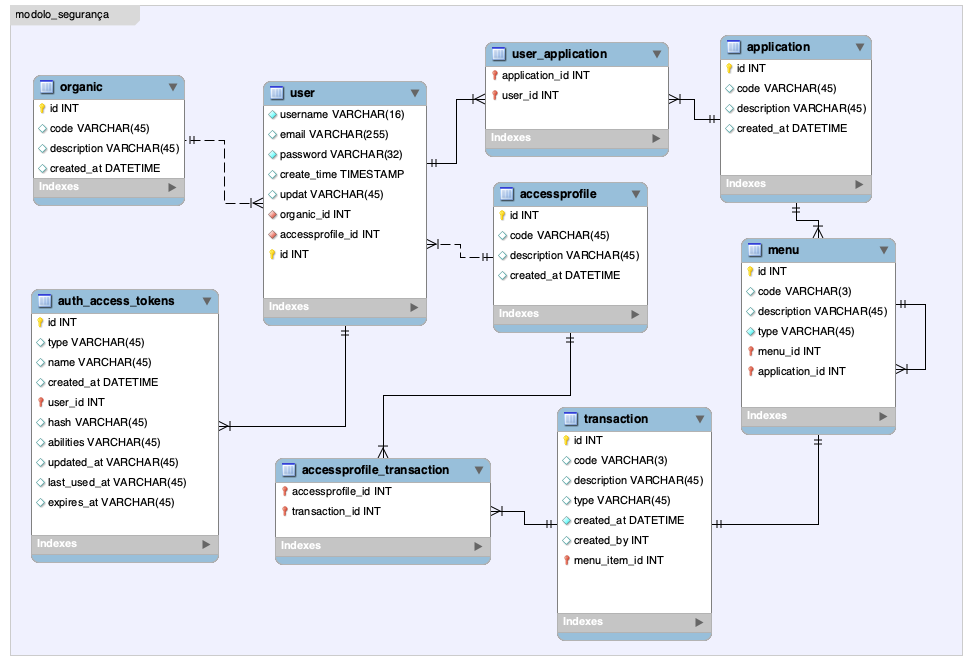

# ******************************************************
#  1. Arquitectura do projecto da API
# ******************************************************

# 1.1 Estrutura do projecto

# 1.2 Requisitos tecnologicos
1. Versão do node: v18.20.4
2. Gestão de dependencias com o npm (npm install)
3. Base de dados mysql
4. Para testar a API: 
      4.1. Postman: https://www.postman.com/product/what-is-postman/
      4.2. curl: https://curl.se
      4.2.1. JPS Para formatar o JSON no curl 
        On macOS: brew install jq
        On Linux: sudo apt-get install jq
         On Windows: Use a package manager like choco or manually download it.
5. AdonisJs para a criação da API: https://docs.adonisjs.com/guides/preface/introduction
6. Lucid ORM (Object-Relational Mapping) : https://lucid.adonisjs.com/docs/introduction
6. VineJs para a validação das request HTTP: https://vinejs.dev/docs/introduction

# 1.3 Como configurar e subir a aplicação
1. Criar a base de dados SGF
2. Criar as tabelas e executar a carga inicial dos dados:
    i. Drop das tabelas: node ace migration:reset 
    ii. Criar as tableas e inserir na base: node ace migration:fresh --seed
    iii. Alterar o ficheiro .env e configurar a base de dados, hostname e porta do servidor
3. npm install
4. Deploy da aplicação: node ace serve --watch
5. Listar todos os seriços disponibilizados: node ace list:routes
6. Build da API para a entrega em produção: node ace build

# 1.4 Comandos uteis
i. commando para matar todos os processos de node em execução
ps aux | grep '[n]ode' | awk '{print $2}'|xargs kill -9

ii. Formatar o codico via command line. Não é necessario se o editor estiver configurado com estas extensões
 npm run lint
 npm run lint -- --fix #Run ESLint and auto-fix issues
 npm run format

ii. Correr no ambiente de desenvolvimento (a flag --hmr ou --watch permite monitorar os recursos)
node ace serve --hmr
node ace serve --watch

iii. Ver os serviços disponibilizados 
node ace list:routes

iv. Links e comandos para a criação de entidades, serviços, controladores, validadores, rotas etc: 
criação das entidades: Model => ( https://lucid.adonisjs.com/docs/models )
criação de controlladores: Controller => (https://docs.adonisjs.com/guides/basics/controllers)
criação de serviços: Services => ()
criação de objectos da base de dados: migrations => (https://lucid.adonisjs.com/docs/migrations)
criação inserção automatica objectos da base de dados: seeder => (https://lucid.adonisjs.com/docs/seeders)
criação de seederes para a insercao dos dados na BD seeder => (https://v5-docs.adonisjs.com/guides/database/seeders)
       
node ace make:model user
node ace make:controller user
node ace make:migreation user
node ace make:seeder MainSeeder/index
node ace make:seeder user
node ace migration:run
node ace migration:reset
node ace migration:fresh --seed
node ace make:model user --cm

# 1.5 Configurar a base de dados - Mysql
i. Step 1: Log in to MySQL
 $ mysql -u root -p

ii. Step 2: Create a New Database
 $ CREATE DATABASE SGF;

iii. Step 3: Create a New User
 $ CREATE USER 'sgfuser'@'localhost' IDENTIFIED BY 'sgf123';

iv. Step 4: Grant Privileges to the New User
 $ GRANT ALL PRIVILEGES ON SGF.* TO 'sgfuser'@'localhost';

v. Step 5: Apply Privileges
 $ FLUSH PRIVILEGES;

vi. Step 6: Exit MySQL
EXIT;

vii. Step 7: Test new MySQL user
 $ mysql -u sgfuser -p -h localhost

viii. Step 8: List tables
 $ show tables;

# 1.6 Como testar a API no Postman
No postman: File -> import -> https://winter-firefly-631772.postman.co/workspace/Sebadora~ce3a5692-37f9-49a8-92d4-9b04f8413c88/   collection/7769307-449d78d4-cb3f-455c-80d7-30d9198fe4a6?action=share&creator=7769307

# **********************************************************************************************************
#  2. Modulos da API do Sistema de Gestão Finançeira
#   2.1 - Modulo de Segurança
#   2.2 - Modulo de Plano e Orcamento
#   2.3 - Modulo de Inscricao e Requisições
# **********************************************************************************************************

## *********************************************************************************************************
# 2.1 - Modulo de Segurança
#    i. Descrição:
#       É o primeiro modulo desenvolvido no projecto e define a estrutura e logica dos 
#        requisitos não funcionais segurnçà e acessos dos utilizadores.
#    ii. Modelo de dados
#        
#    iii. Funçionalidades:
#         1. Login e Logout
#         2. Registrar utilizador
#         3. Recuperar senha
#         4. Altarar senha
#    iv.  Configurar o modulo
#    v.   Serviços disponibilizados: 
## ********************************************************************************************************

# iv - Configurar o modulo de segurança
1. Step 1: Criação do projecto API com auth tipo tokens
npm init adonisjs@latest sgf-api -- --kit=api --auth-guard=access_tokens --db=mysql

2. Step 2: Commitar o projecto no repositorio gitlab
cd sgf-api
git remote add origin https://gitlab.com/sebadora/sgf/sgf-api.git
git branch -M developer
git push -uf origin developer

# v. Serviços
1. Step1: Autenticação com token

curl --location 'http://localhost:3333/auth/login' \
--header 'Content-Type: application/json' \
--data-raw '{
"email":"root@gmail.com",
"password":"sebadora123"
}'

2. Logout
2. Criação do utilizador
3. Listar utilizadores
4. Altarar senha
4. Recuperar senha

##### *****************************************************
# 2 - Modulo de Plano e Orçamento
#    i. Descricao:
#       É o primeiro modulo desenvolvido no projecto e define a estrutura e logica dos requisitos não        #       funcional segurnçà e acessos dos utilizadores.
#    ii. Modelo de dados
#       
#   iii. Funcionalidades esperadas neste modulo
#      1.
#      2.
#      3.
#      4.
#      5.
#   v. Serviços:
#      
##### *****************************************************

v. Serviços disponibilizados pela API para o Modulo de plano de contas

# v.1 Criar plano de contas (createAccountPlan)
# O atributo "writable" diz se a conta é de movimento ou controle [ moviment, controll ]
# O atributo "type" diz se a conta é de orcamento ou financeira [ budject, financial ]
# O atributo "class" diz se a classe da conta:
#        [A = 'A'] //'X.0.0.0.00'
#        [B = 'B'], //'X.X.0.0.00'
#        [C = 'C'], //'X.X.X.0.00'
#        [D = 'D'], //'X.X.X.X.00'
#        [E = 'E'], //'X.X.X.X.XX'

curl -s --location 'http://localhost:3333/sgf-api/planbudject/accountplan/createAccountPlan' \
--header 'Content-Type: application/json' \
--data ' {
        "number": "1.1.1.1.05",
        "description": "Vencimento Base do Pessoal Civil Fora do Quadro11",
        "writable": "moviment",
        "type": "budject",
        "class": "2"
    }' | jq

# v.2 Listar todos os planos de conta (findAllActiveAccountPlan)
# Lista todos os planos de contas activos no sistema
curl -s --location --request GET 'http://localhost:3333/sgf-api/planbudject/accountplan/findAllActiveAccountPlan' --header 'Content-Type: application/json' | jq

# v.3 Buscar plano de conta pelo numero da conta (findAccountPlanByNumber)
# Busca o plano de conta activo atraves do numero da conta
curl -s --location --request GET 'http://localhost:3333/sgf-api/planbudject/accountplan/findAccountPlanByNumber' --header 'Content-Type: application/json' | jq

# v.4. Listar todos os planos orçamentais
curl -s --location 'http://localhost:3333/sgf-api/planbudject/findAllAccountPlanBudjectEntries' \
--header 'Content-Type: application/json' \
--data-raw '{
"email":"root@gmail.com",
"password":"sebadora123"
}' | jq

# Criar um orcamento

# Listar todos os planos orçamentais 
curl -s --location 'http://localhost:3333/sgf-api/planbudject/createAccountPlanBudjectEntry' \
--header 'Content-Type: application/json' \
--data ' {
        "startPostingMonth": 1,
        "endPostingMonth": 12,
        "initialAllocation": 1200000,
        "accountPlanNumber": "1.1.1.1.02"
    }' | jq

# Listar todos os planos orçamentais  com as respectivas entradas
curl -s --location 'http://localhost:3333/sgf-api/planbudject/fetchAllAccountPlanBudjectEntries' \
--header 'Content-Type: application/json' \
--data-raw '{
"email":"root@gmail.com",
"password":"sebadora123"
}' | jq